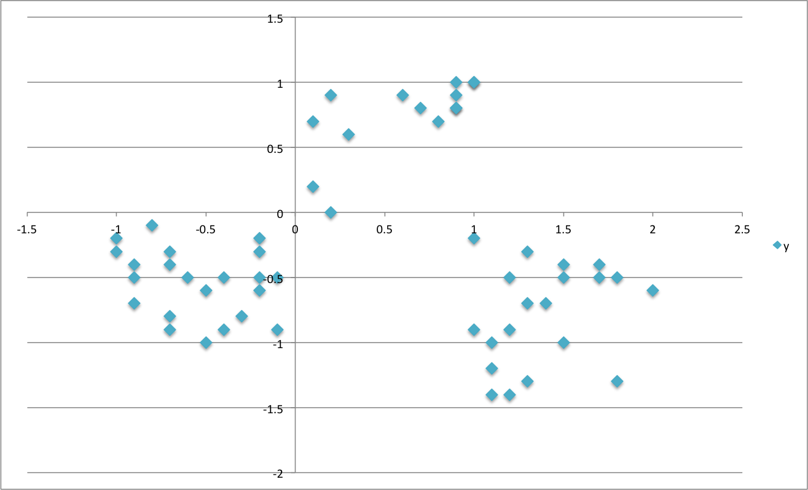

```{r setup, include=FALSE}
knitr::opts_chunk$set(
    echo = TRUE,
    message = FALSE,
    warning = FALSE,
    out.width = "80%",
    out.height = "100%",
    fig.align = "center")
```

```{r, include=FALSE}
# turn off locale-specific sorting for messages in English
Sys.setlocale("LC_TIME", "C")
```

# Overview

[__Market segmentation__](https://en.wikipedia.org/wiki/Market_segmentation) refers to the process of dividing a consumer market of existing and/or potential customers into groups (or segments) based on shared attributes, interests, and behaviours. 

For this mini-project I will use the popular [__K-Means clustering__](https://en.wikipedia.org/wiki/K-means_clustering) algorithm to segment customers based on their response to a series of __marketing campaigns__. The basic concept is that consumers who share common traits would respond to __marketing communication__ in a similar way so that companies can reach out for each group in a relevant and effective way. 

### What is K-Means Clustering? 
__K-Means clustering__ is part of the [__Unsupervised Learning__](https://en.wikipedia.org/wiki/Unsupervised_learning) modelling family, a set of techniques used to find patterns in data that has not been labelled, classified or categorized. As this method does not require to have a target for clustering, it can be of great help in the exploratory phase of customer segmentation. 

The fundamental idea is that customers assigned to a group are as similar as possible, whereas customers belonging to different groups are as dissimilar as possible. Each cluster is represented by its `centre`, corresponding to the mean of elements assigned to the cluster.

To illustrate the principle, suppose that you have a set of elements like those in the picture below and want to classify them into __3 clusters__ 
```{r random points, out.width="450px", echo=FALSE}

```

What K-Means would do for you is to group them up around the middle or `centre` of each cluster, represented here by the __"X"'s__, in a way that minimises the distance of each element to its `centre`
```{r ramdom points clusters, out.width="450px", echo=FALSE}

```

So how does that help you to __better understand your customers__? Well, in this case you can use their __behavior__ (specifically, which offer they did or did not go for) as a way to grouping them up with similar minded customers.  You can now look into each of those groups to unearth trends and patterns and use them for shaping future offers.

__On a slightly more technical note__, it's important to mention that there are many K-Means algorithms available ( _Hartigan-Wong_, _Lloyd_, _MacQueen_ to name but a few) but they all share the same basic concept: each element is assigned to a cluster so that it minimises the __sum of squares Euclidean Distance__ to the `centre` - a process also referred to as minimising the __total within-cluster sum of squares__ (`tot.withinss`).  

### Loading the Packages
```{r packages}
library(tidyverse)
library(lubridate)
library(knitr)
library(readxl)
library(broom)
library(umap)
library(ggrepel)
library(plotly)
```
# The Data

The [dataset](https://media.wiley.com/product_ancillary/6X/11186614/DOWNLOAD/ch02.zip) comes from [John Foreman](http://www.john-foreman.com/blog)'s book, [Data Smart](http://www.wiley.com/WileyCDA/WileyTitle/productCd-111866146X.html). It contains __sales promotion__ data for a __fictional wine retailer__ and includes details of _32 promotions_ (including wine variety, minimum purchase quantity, percentage discount, and country of origin) and a list of _100 customers_ and the promotions they responded to.   

```{r offers}
offers_tbl <- read_excel('../00_data/WineKMC.xlsx', sheet = 'OfferInformation')

offers_tbl <- offers_tbl %>% 
        set_names(c('offer', 'campaign', 'varietal', 'min_qty_kg', 
                    'disc_pct','origin', 'past_peak'))

kable(head(offers_tbl))
```

```{r transactions}
transac_tbl <- read_excel('../00_data/WineKMC.xlsx', sheet = 'Transactions')

transac_tbl <- transac_tbl %>% 
        set_names(c('customer', 'offer'))

kable(head(transac_tbl))
```

The data needs to be converted to a `User-Item format`(a.k.a. _Customer-Product matrix_),  featuring _customers_ across the top and _offers_ down the side. The cells are populated with __0's__ and __1’s__, where  __1’s__ indicate if a customer responded to a specific offer. 

This type of matrix is also known as __binary rating matrix__ and _does NOT require normalisation_.

```{r user_item format}
wine_tbl <- transac_tbl %>% 
    left_join(offers_tbl) %>% 
    mutate(value = 1) %>%
    spread(customer,value, fill = 0) 

kable(head(wine_tbl))
```

# Clustering the Customers

The K-Means algorithm comes with the __stats__ package, one of the __Core System Libraries__ in R, and is fairly straightforward to use. I just need to pass a few parameters to the __kmeans()__ function.
```{r clustering }
user_item_tbl <- wine_tbl[,8:107]

set.seed(196)             # for reproducibility of clusters visualisation with UMAP
kmeans_obj <- user_item_tbl %>%  
    kmeans(centers = 5,   # number of clusters to divide customer list into
           nstart = 100,  # specify number of random sets to be chosen
           iter.max = 50) # maximum number of iterations allowed - 
```

I can quickly inspect the model with`glance()`from the `broom`package, which provides an summary of model-level statistics
```{r glance, collapse = T}
glance(kmeans_obj) %>% glimpse()
```

The one metric to really keep an eye on is the __total within-cluster sum of squares__ (or `tot.withinss`) as the optimal number of clusters is that which minimises the `tot.withinss`. So I want to fit the k-means model for different number of clusters and see where `tot.withinss` reaches its minimum.

First, I build a function for a set number of `centers` (4 in this case) and check that is working on `glance()`.
```{r}
kmeans_map <- function(centers = 4) {
    user_item_tbl %>%  
        kmeans(centers = centers, nstart = 100, iter.max = 50)
}
```

```{r, collapse = T}
4 %>% kmeans_map() %>%  glance()
```


Then, I create a __nested tibble__, which is a way of "nesting" columns inside a data frame. The great thing about nested data frames is that you can put essentially anything you want in them: lists, models, data frames, plots, etc!

```{r}
kmeans_map_tbl <- tibble(centers = 1:15) %>%  # create column with centres 
          mutate(k_means = centers %>% 
                  map(kmeans_map)) %>%    # iterate `kmeans_map` row-wise to gather 
                                          # kmeans models for each centre in column 2
          mutate(glance = k_means %>%  
                  map(glance))            # apply `glance()` row-wise to gather each
                                          # model’s summary metrics in column 3

kmeans_map_tbl %>% glimpse()
```

Last, I can build a `scree plot` and look for the "elbow" on the graph, the point where the number of additional clusters seem to level off. In this case __5__ appears to be an optimal number as the drop in `tot.withinss` for 6 is not as pronounced as the previous one.
```{r}
kmeans_map_tbl %>% 
    unnest(glance) %>%                           # unnest the glance column
    select(centers, tot.withinss) %>%            # select centers and tot.withinss
    
    ggplot(aes(x = centers, y = tot.withinss)) + 
    geom_line(colour = 'grey30', size = .8) +
    geom_point(colour = 'green4', size = 3) +
    geom_label_repel(aes(label = centers), 
                     colour = 'grey30') +
    theme_bw() +
    labs(title = 'Scree Plot')
```


# Visualising the Segments

Now that I have identified the optimal number of clusters I want to visualise them. To do so, I use the [__UMAP__](https://umap-learn.readthedocs.io/en/latest/) ( _Uniform Manifold Approximation and Projection_ ), a dimentionality reduction technique that can be used for cluster visualisation in a similar way to [__Principal Component Analysis__](https://en.wikipedia.org/wiki/Principal_component_analysis) and [__t-SNE__](https://en.wikipedia.org/wiki/T-distributed_stochastic_neighbor_embedding). 

First, I create a umap object and pull out the `layout` argument (containing coordinates that can be used to visualize the dataset), change its format to a tibble and attach the `offer` column from the `wine_tbl`.

```{r}
umap_obj <- user_item_tbl %>%  umap() 

umap_tbl <- umap_obj$layout %>% 
    as_tibble() %>%                       # change to a tibble
    set_names(c('x', 'y')) %>%            # remane columns
    bind_cols(wine_tbl %>% select(offer)) # attach offer reference
```

Then, I `pluck` the 5th kmeans model from the __nested tibble__, attach the _cluster_ argument from the `kmeans` function to the output, and join offer and cluster to the umap_tbl.
```{r}
umap_kmeans_5_tbl <- kmeans_map_tbl %>% 
    pull(k_means) %>%
    pluck(5) %>%                          # pluck element 5 
    broom::augment(wine_tbl) %>%          # attach .cluster to the tibble 
    select(offer, .cluster) %>% 
    left_join(umap_tbl, by = 'offer')     # join umap_tbl to clusters by offer
```

At last, I can visualise the UMAP'ed projections of the clusters. `plotly` adds some nice interactivity, which brings the chart to life!
```{r}
g <- umap_kmeans_5_tbl %>% 
    mutate(label_text = str_glue('Offer: {offer}
                                  Cluster: {.cluster}')) %>%
    ggplot(aes(x,y, colour = .cluster)) +
    geom_point(aes(text = label_text)) +
    theme_light() +
    labs(title    = 'UMAP 2D Projections of K-Means Clusters',
         caption  = "") +
    theme(legend.position = 'none')

ggplotly(g, tooltip = "label_text")
```

# Evaluating the Clusters

Now we can finally have a closer look at the single clusters to see what K-Means has identified. 

But let's first bring all information together in one data frame.


```{r}
cluster_trends_tbl <- wine_tbl %>%
    left_join(umap_kmeans_5_tbl) %>%
    arrange(.cluster) %>%
    select(.cluster, offer:past_peak)
```


### Cluster 1 & 2

Customers in __cluster 1__ purchase __high volumes of sparkling wines__ (Champagne and Prosecco) whilts those in the __second segment__ favour __low volume purchases__ of different varieties.
```{r}
cluster_trends_tbl %>% 
    filter(.cluster ==1 | .cluster ==2) %>% 
    count(.cluster, varietal, origin, min_qty_kg, disc_pct) %>%
    select(-n) %>% 
    kable()
```

### Cluster 3 & 4

Customers in these groups have very specific taste when it comes to wine: those in the __third segment__ have a penchant for __Pinot Noir__, whereas __group 4__ only buys __French Champagne in high volumes__.
```{r}
cluster_trends_tbl %>% 
    filter(.cluster ==3 | .cluster ==4 ) %>% 
    group_by() %>%
    count(.cluster, varietal, origin, min_qty_kg, disc_pct) %>%
    select(-n) %>%
    kable()
```

### Cluster 5

The __fifth segment__ is a little more difficult to categorise as it encompasses many different attributes. The only clear trend is that customers in this segment picked up all available __Cabernet Sauvignon__ offers.
```{r}
cluster_trends_tbl %>% 
    filter(.cluster ==5 ) %>% 
    count(.cluster, varietal, origin, min_qty_kg, disc_pct) %>%
    select(-n) %>% 
    kable()
```


# Final thoughts
Although it's not going to give you all the answers, clustering is a powerful exploratory exercise that can help you reveal patterns in your consumer base, especially when you have a brand new market to explore and do not have any prior knowledge of it. 

It's very easy to implement and even on a small dataset like the one I used here, you can unearth interesting patterns of behaviour in your customer base. 

With little effort we have leaned that some of our customers _favour certain varieties of wine_ whereas others prefer to _buy high or low quantities_. Such information can be used to tailor your __pricing strategies__ and __marketing campaings__ towards those customers that are more inclined to respond. Moreover, customer segmentation allows for a more efficient allocation of marketing resources and the maximization of cross- and up-selling opportunities.

Segmentation can also be enriched by overlaying information such as a customers' __demographics__ (age, race, religion, gender, family size, ethnicity, income, education level), __geography__ (where they live and work), and __psychographic__ (social class, lifestyle and personality characteristics) but these go beyond the scope of this mini-project. 


### Code Repository
The full R code can be found on [my GitHub profile](https://github.com/DiegoUsaiUK/Customer_Segmentation)


### References

* For a broader view on the potential of [Customer Segmentation](https://medium.com/@kristenkehrer/how-to-use-customer-segmentation-to-learn-f49e82b9a959)
* For a critique of some of [k-means drawback](https://www.datascience.com/blog/k-means-alternatives)
* [Customer Segmentation at Bain & Company](https://www.bain.com/insights/management-tools-customer-segmentation)
